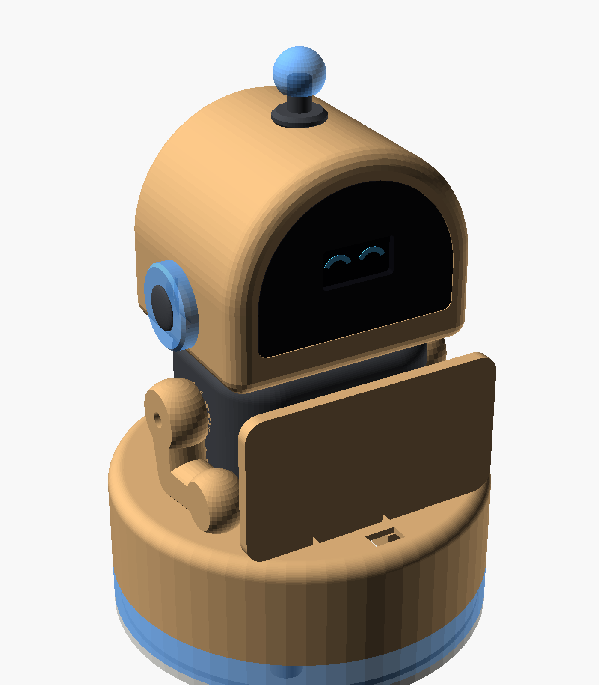
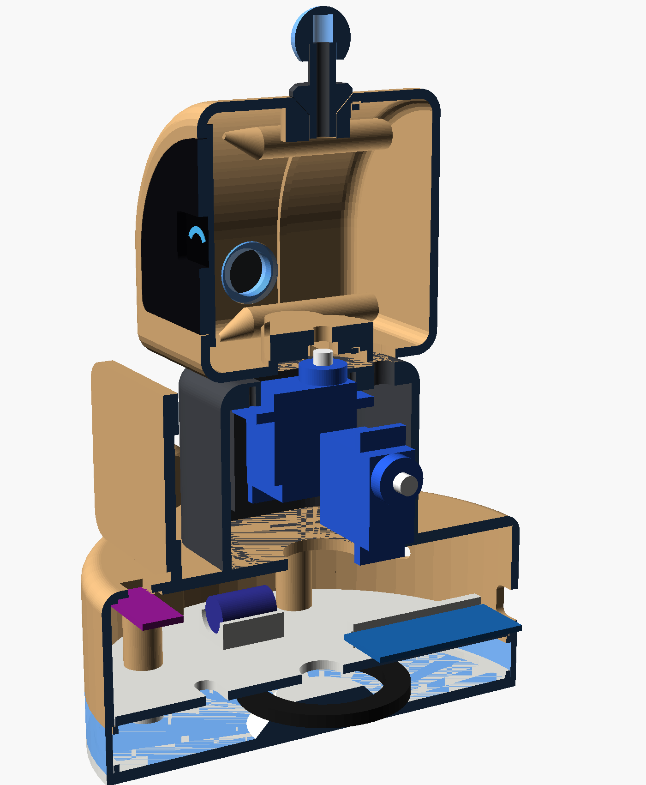
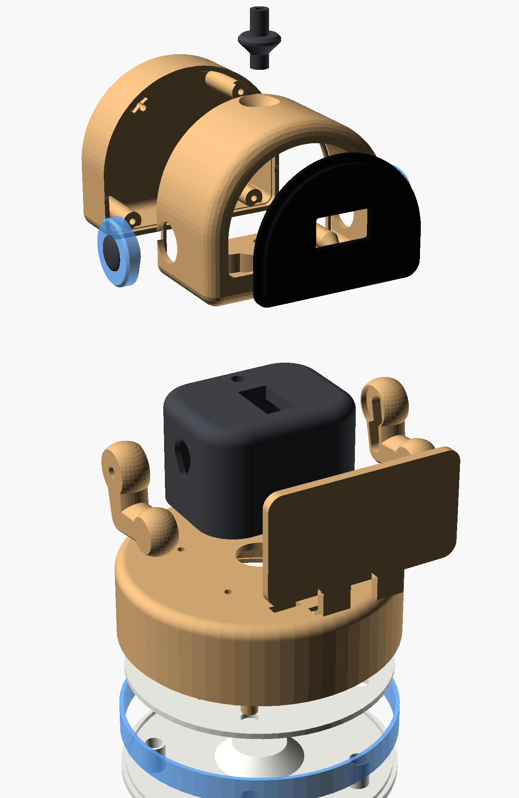

# Thank-You Robot – 3D-printable enclosure

A desk robot for shops: a customer taps their phone on the sign (NFC opens the Google review page), the robot "wakes up", turns its head, waves its arms, shows happy eyes and lights the glow ring.



| Cutaway (electronics in place) | Exploded |
|---|---|
|  |  |

**Overall size:** about 120 mm wide (base) × 182 mm tall. Every part fits on a 180 × 180 mm bed.

Everything is generated from one parametric file, [`robot.scad`](robot.scad) (OpenSCAD 2021+). Print-ready STLs are in [`stl/`](stl/), already rotated into print orientation.

## Parts to print

| STL | Qty | Suggested filament | Notes |
|---|---|---|---|
| `base_floor` | 1 | white PLA | Includes the reflector cone and the spacer tubes for the deck |
| `base_band` | 1 | **translucent / natural** PLA or PETG | The glowing ring |
| `base_deck` | 1 | white PLA | Electronics tray. Nano rails and capacitor saddle on top, LED ring glued underneath |
| `base_shell` | 1 | wood PLA | Prints upside down |
| `body` | 1 | dark grey PLA | Prints upside down |
| `head_front` | 1 | wood PLA | Prints face down |
| `head_back` | 1 | wood PLA | Prints back down |
| `face_plate` | 1 | **black** PLA | Prints flange down. The OLED sits in the pocket at the back |
| `arm_right`, `arm_left` | 1 each | wood PLA | Print flat. The horn pocket faces up |
| `sign` | 1 | wood / white PLA | Blank. Has a 26 mm pocket on the back for the NTAG213 sticker |
| `ear_ring` | 2 | translucent PLA | |
| `ear_cap` | 2 | dark grey PLA | |
| `antenna_stem` | 1 | dark grey PLA | |
| `antenna_ball` | 1 | translucent PLA | |

Suggested settings: 0.2 mm layers, 3 walls, 15–20 % infill. No supports should be needed. If your printer bridges poorly, enable "support on build plate only" for `head_front`, which has a 25 mm horizontal hole at the neck. Expect roughly 200–250 g of filament in total.

## Electronics, and where each part goes

| Part | Location |
|---|---|
| Arduino Nano V3 | Slides into the grooved rails on the deck. The mini-USB faces the back wall and can be reached through the back hole for programming |
| SG90 #1 (head) | Inserted from below into the body's top plate, tabs screwed up into the plate. The shaft is the head's rotation axis |
| SG90 #2 + #3 (arms) | One in each side pad of the body. The shaft comes out through the side wall and the arm bolts onto the single-arm horn |
| WS2812B 16-LED ring | Hot-glued centred **under** the deck, LEDs facing down onto the white cone. The light comes out through the translucent band |
| VL53L0X | Glued into the pocket under the base top, in front of the sign, looking up through the small window |
| NTAG213 | Sticker in the pocket on the back of the sign, so the customer taps the sign |
| 0.96" SSD1306 OLED | Glass sits in the pocket behind the face plate (hot glue the PCB) |
| USB-C 5V breakout | Back of the base, left opening (9.8 × 4.2 mm) |
| Mini rocker switch (KCD11, 19 × 13 mm) | Back of the base, right opening |
| 1000 µF capacitor | Saddle on the deck, wired across 5V/GND near the LED ring |
| 330 Ω resistor | Inline on the LED ring data wire |

Suggested Nano wiring:

| Signal | Nano pin |
|---|---|
| Head servo | D9 |
| Left arm servo | D10 |
| Right arm servo | D11 |
| LED ring DIN (through 330 Ω) | D6 |
| OLED + VL53L0X (shared I²C bus, addresses 0x3C and 0x29) | A4 = SDA, A5 = SCL |
| 5V rail (switch → servos, ring, OLED, sensor, Nano 5V pin) | 5V / GND |

Power the robot from the USB-C breakout through the switch, **not** from the Nano's USB port. Three servos plus 16 LEDs can draw more than the Nano's USB diode is rated for. Your 5V / 2A adapter is enough.

## Hardware

- 4 × M3×12: floor → shell (from underneath)
- 4 × M3×12: base top → body (from inside the base, before the deck goes in)
- 4 × M3×16: back of the head → front of the head
- Servo screws (come with the SG90s)
- 4 × 10 mm rubber feet (optional)

## Assembly order

1. **Body:** push both arm servos sideways into the side pads and screw their tabs in. Then push the head servo up into the top plate and screw it in. The arm servos must go in first.
2. **Head:** glue the OLED behind the face plate and glue the face plate into the front half. Run the OLED wires through the slot in the head floor and close the head with the back half.
3. Press the head servo's single-arm horn into the slot under the head and push the head onto the servo spline. The horn screw can be reached with a long screwdriver **through the antenna hole**. Then press in the antenna.
4. Screw the body onto the base shell from inside. Feed all the cables down through the big centre hole.
5. Fit the electronics on the deck and the LED ring under it. Put the deck into the shell (it rests on the inner ledge), add the band and the floor, and screw everything together from below.
6. Fit the arms onto the arm-servo horns, then slot in the sign.

**Before fixing the arm horns**, set each arm servo to the position where the arm hangs at rest (hand near the base) and mount the arm there. In code, only move the arms **upward/forward** from that position, because moving backward runs the hand into the base. Limit the head to about ±40°.

## Customising

All key dimensions are variables at the top of `robot.scad`: base / body / head size, servo dimensions, opening sizes for your exact USB board and switch, OLED window, sign size, and so on. To regenerate one STL:

```
openscad -D 'part="head_front"' -o stl/head_front.stl robot.scad
```

Preview modes: `part="assembly"`, `"exploded"` and `"cutaway"`.
