# Thank-You Robot Assembly Manual

Oct 10, 2026

Build order: servos into the body, head on top, body onto the base, electronics into the base, then close it up and add the arms and sign. Plan about 2 hours once all parts are printed.

{.cover}

## Before you start

Gather everything below first. The STL files are in `thank_you_robot_stl.zip`.

| Printed part | Qty | Filament |
| --- | --- | --- |
| base_floor | 1 | white |
| base_band | 1 | translucent |
| base_deck | 1 | white |
| base_shell | 1 | wood |
| body | 1 | dark grey |
| head_front, head_back | 1 each | wood |
| face_plate | 1 | black |
| arm_right, arm_left | 1 each | wood |
| sign | 1 | wood or white |
| ear_ring | 2 | translucent |
| ear_cap | 2 | dark grey |
| antenna_stem | 1 | dark grey |
| antenna_ball | 1 | translucent |

Electronics:

- [ ] Arduino Nano V3
- [ ] 3 × SG90 servo (1 head, 2 arms), with their horns and screws
- [ ] WS2812B 16-LED ring
- [ ] VL53L0X distance sensor
- [ ] NTAG213 sticker (25 mm round)
- [ ] 0.96" SSD1306 OLED, I²C, 4 pins
- [ ] USB-C 5V power breakout board + your 5V / 2A adapter
- [ ] Mini rocker switch (19 × 13 mm)
- [ ] 1000 µF 10V capacitor
- [ ] 330 Ω resistor
- [ ] Dupont wires, plus a few spare wires for the 5V and GND rail

Screws and tools:

- [ ] 8 × M3×12 screws (base and body)
- [ ] 4 × M3×16 screws (head)
- [ ] Small Phillips screwdriver, plus a long thin one for the head
- [ ] Hot glue gun
- [ ] Soldering iron (only for the 5V rail, switch and USB-C board)
- [ ] 4 rubber feet (optional)

## Step 1: Prepare the servos and wires

Center all three servos at 90° before you mount anything, so the head and arms go on in the right position.

1. Upload this sketch to the Nano over its USB cable. Plug the servo signal wires into D9 (head), D10 (left arm) and D11 (right arm), red to 5V, brown to GND.
2. Let it run for 2 seconds, then unplug. Don't turn the shafts by hand after this.
3. Label the three servos HEAD, LEFT and RIGHT with tape.
4. Prepare long wires: the OLED needs 4 wires about 30 cm long, because they run from the head down to the base. Standard 20 cm Dupont wires are too short, so join two.

```cpp
#include <Servo.h>
Servo head, armL, armR;
void setup() {
  head.attach(9);  armL.attach(10);  armR.attach(11);
  head.write(90);  armL.write(90);   armR.write(90);
}
void loop() {}
```

## Step 2: Mount the arm servos in the body

The arm servos go in first, because the head servo blocks the space once it is in.

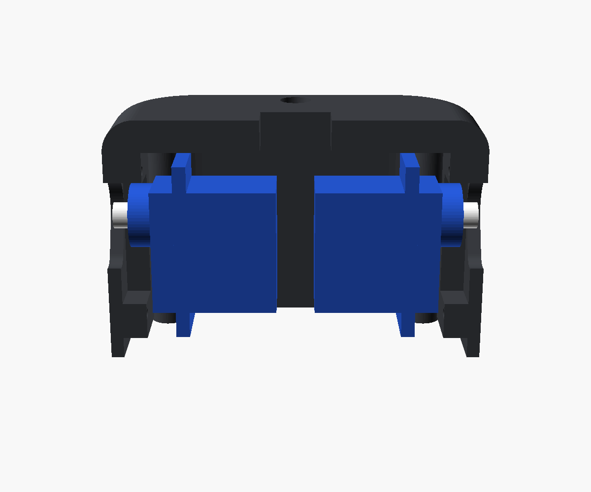

1. Hold the body upside down, so the open bottom faces you.
2. Put the LEFT servo inside with its shaft pointing at the left wall.
3. Slide it outward until its top sits in the pocket and the round boss pokes out through the side hole.
4. Its two mounting tabs now lie flat on the pad. Screw them in with the small servo screws.
5. Do the same with the RIGHT servo on the right side.
6. Let both cables hang out of the open bottom.

## Step 3: Mount the head servo in the body

The head servo pushes up from below into the rectangular hole in the top plate, with its shaft in the center of the body.

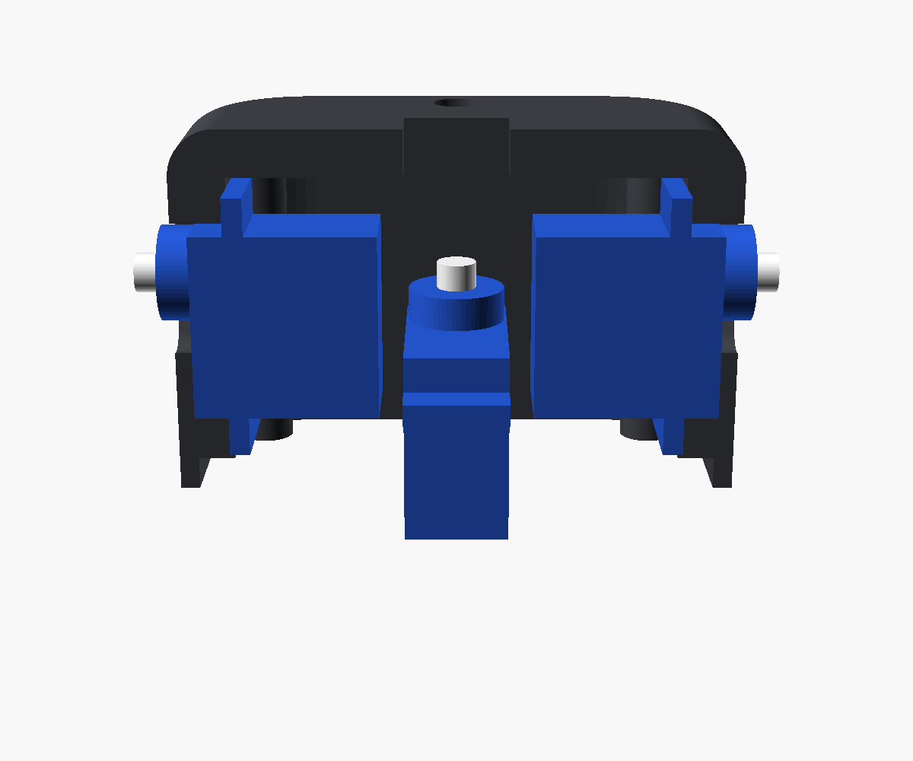

1. Keep the body upside down.
2. Turn the HEAD servo so its shaft is toward the back of the robot, near the small round wire hole.
3. Push it in between the two arm servos until its tabs touch the underside of the top plate. Only the round boss and the shaft stick out on top.
4. Screw the two tabs to the plate from inside.
5. Check the shaft is in the middle of the top. If it isn't, the servo is turned the wrong way round.

## Step 4: Build the head

The OLED goes behind the black face plate, the face plate goes into the front half, then the back half closes the head with 4 screws.

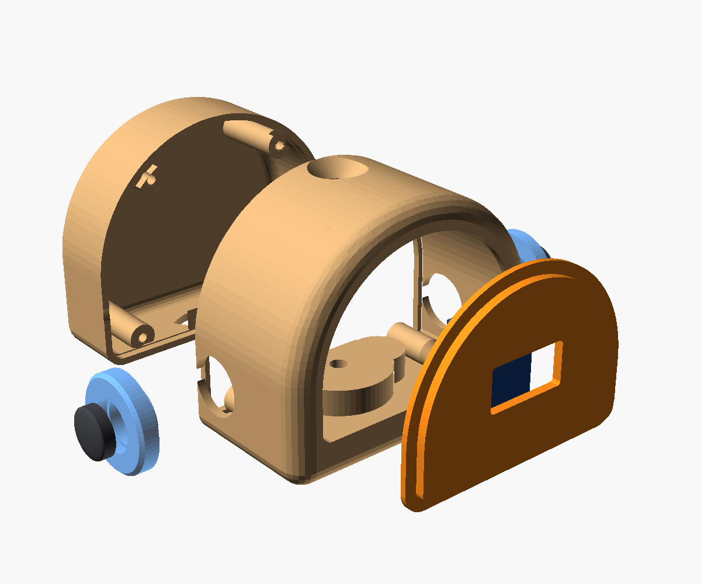

1. Plug the 4 long wires onto the OLED pins (VCC, GND, SCL, SDA) and mark which is which.
2. Lay the face plate face-down. Drop the OLED glass into the rectangular pocket on its back, pins at the top. Hot glue the OLED board edges.
3. Push the face plate into the front opening of the head from inside, so its rim sits behind the wall. Glue the rim.
4. Press each ear ring into its side hole, then press a dark cap into the middle of each ring. A drop of glue holds them.
5. Feed the OLED wires down through the curved slot in the head floor, so they hang out under the head.
6. Put the back half on and fasten it with 4 × M3×16 screws from the back.

If the eyes show upside down later, flip the screen in code (`setRotation(2)`). No need to rebuild.

## Step 5: Put the head on the servo and add the antenna

The head sits on the head servo's shaft through a horn glued under the head. The horn screw is reached through the antenna hole.

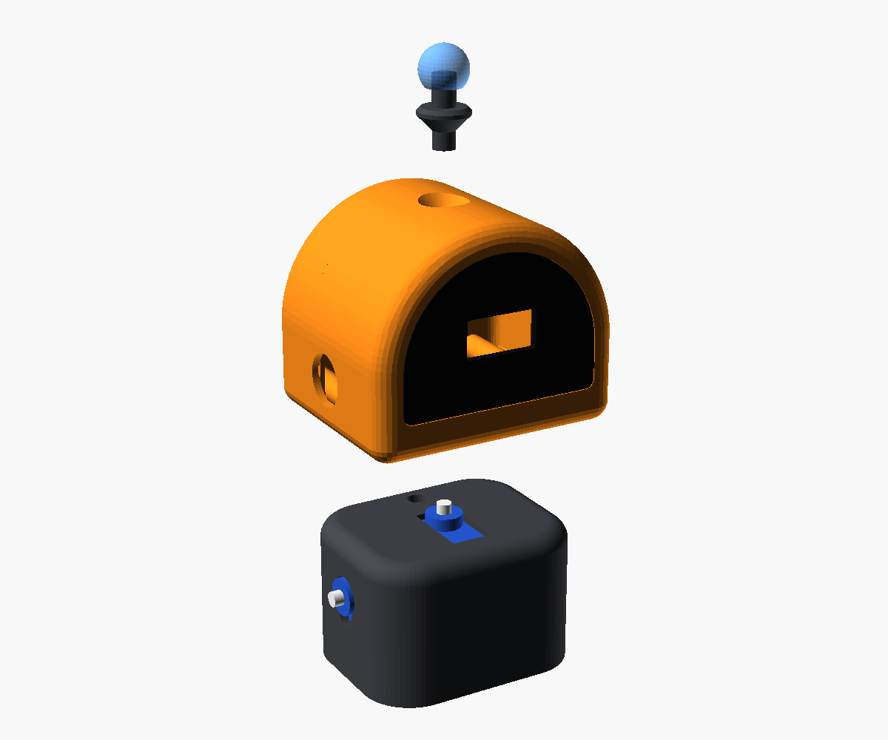

1. Take a single-arm horn (the one with one long arm) from the head servo's bag.
2. Press it into the slot under the head, hub over the center hole. Add a drop of glue.
3. Feed the OLED wires through the small round hole at the back of the body's top plate, down into the body.
4. Point the face straight forward and press the head down onto the shaft. The servo is still at 90° from Step 1.
5. Put a long thin screwdriver through the antenna hole on top and drive the horn screw into the shaft.
6. Push the antenna stem into the top hole (a drop of glue), then press the ball onto the stem.

The head should clear the body by about 1 mm and not rub when you turn it gently.

## Step 6: Screw the body onto the base

The body sits on the base shell's top and is held by 4 screws from inside the base.

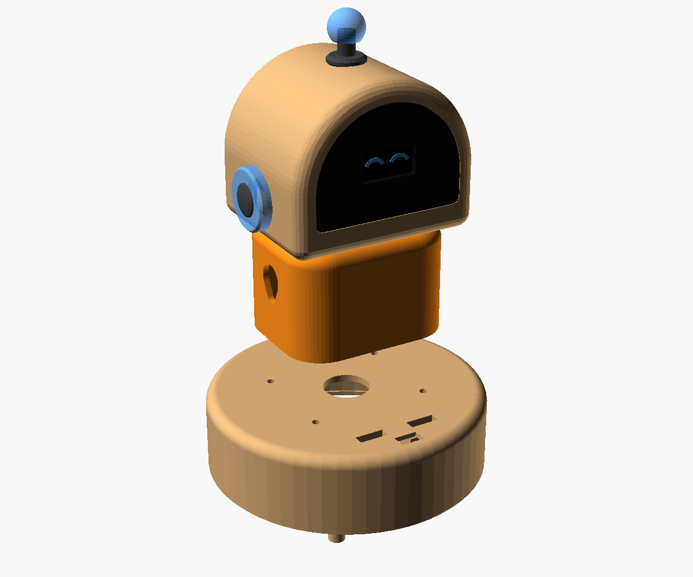

1. Feed all the cables (3 servo cables + 4 OLED wires) down through the big hole in the middle of the base top.
2. Turn the body so the face points at the two sign slots, which are the front of the base.
3. Hold it in place, turn the whole thing on its side and drive 4 × M3×12 screws up through the small holes in the base top into the body's corners.

## Step 7: Fit the electronics

The Nano, capacitor and LED ring go on the white deck. The sensor, switch and USB-C board go in the base shell.

**On the deck:**

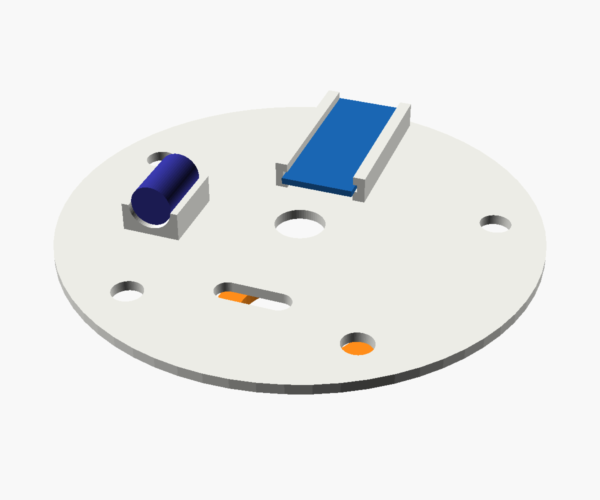

1. Slide the Nano into the two grooved rails, USB end toward the deck's edge. Pins point up.
2. Lay the 1000 µF capacitor in its saddle. The stripe on the can is the minus (GND) leg.

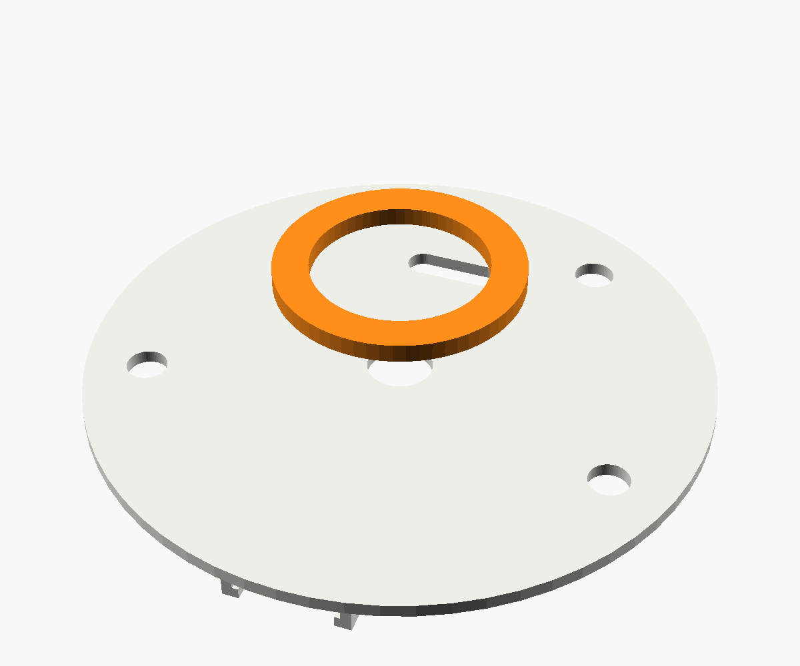

3. Turn the deck over. Hot glue the LED ring in the center, LEDs facing away from the deck.
4. Pass the ring's 3 wires (5V, GND, DIN) up through the center hole.

**In the base shell** (turned upside down):

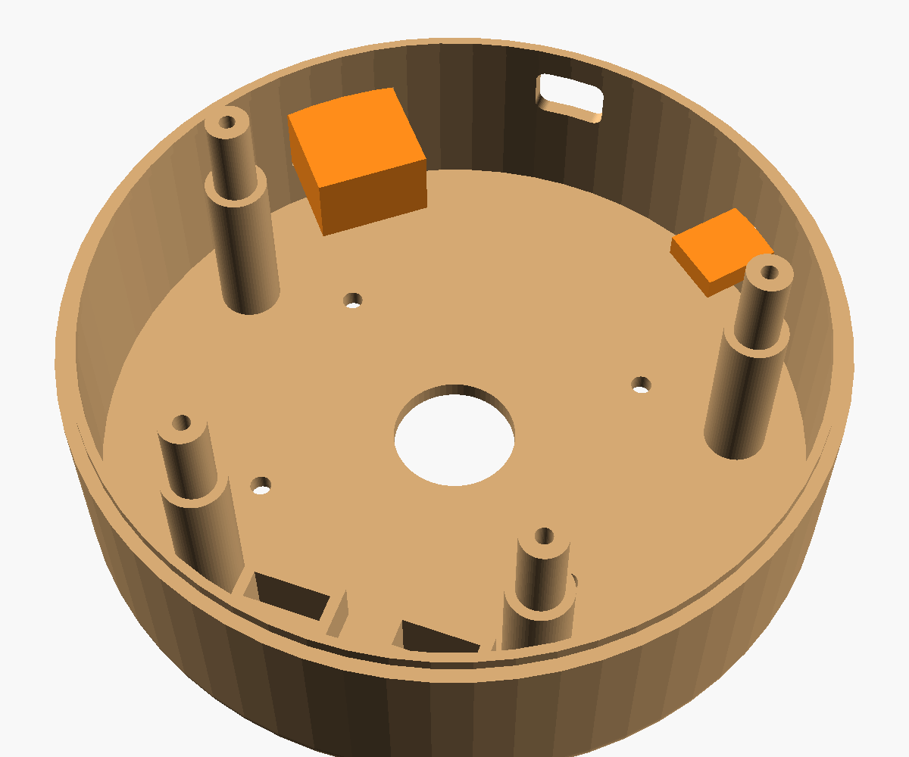

5. Glue the VL53L0X into the shallow pocket at the front, sensor chip facing out through the small window.
6. The back wall has 3 holes. Snap the rocker switch into the big rectangle.
7. Hot glue the USB-C board behind the narrow slot, port facing out.
8. The rounded hole in the middle is for the Nano's USB cable. You'll line the Nano up with it in Step 9.

## Step 8: Wiring

Each part has one signal wire to the Nano. Every part also takes 5V and GND from one shared power rail, never from the Nano's 5V pin.

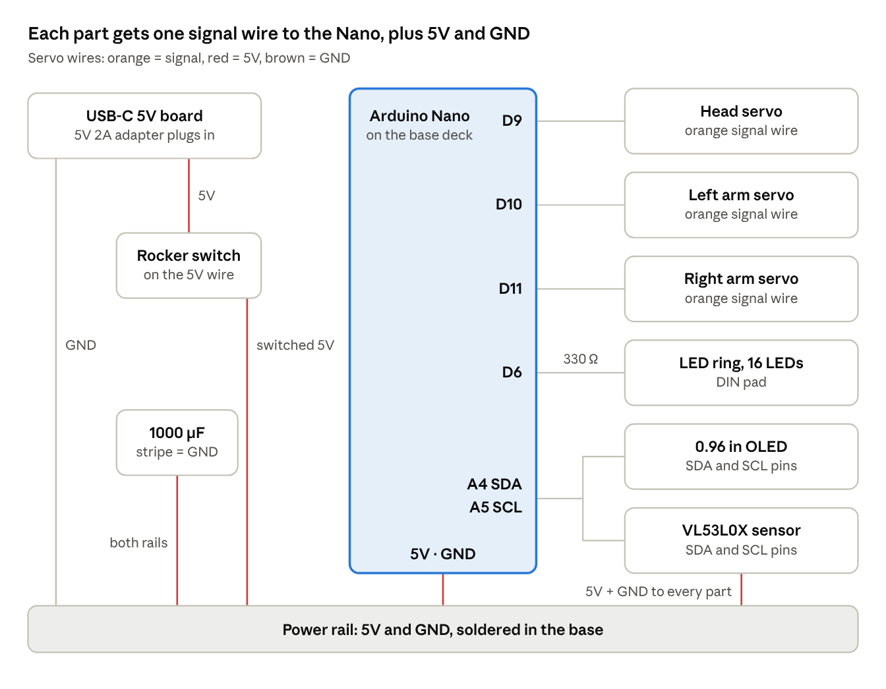{.wide}

Make the rail from a small piece of perfboard (or a 2-row screw terminal) glued to the deck. Tick each wire off as you connect it:

- [ ] USB-C board + → switch → 5V rail
- [ ] USB-C board − → GND rail
- [ ] Capacitor across the 5V and GND rails, stripe side to GND
- [ ] Nano 5V pin → 5V rail, Nano GND → GND rail
- [ ] Head servo: red → 5V, brown → GND, orange → D9
- [ ] Left arm servo: red → 5V, brown → GND, orange → D10
- [ ] Right arm servo: red → 5V, brown → GND, orange → D11
- [ ] LED ring: 5V → 5V, GND → GND, DIN → 330 Ω resistor → D6
- [ ] OLED: VCC → 5V, GND → GND, SDA → A4, SCL → A5
- [ ] VL53L0X: VIN → 5V, GND → GND, SDA → A4, SCL → A5

The OLED and the sensor share A4 and A5. Join each pair of wires with a Dupont splitter or a small solder joint.

## Step 9: Close the base

Wire everything first (Step 8), then stack the deck, glow band and floor and screw them together from below.

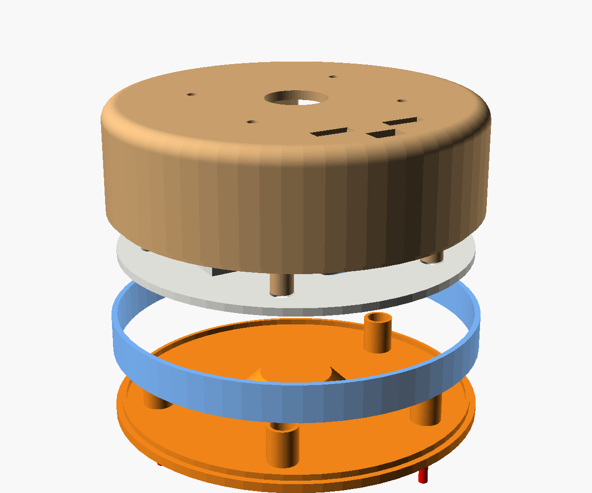

1. With the shell upside down, lower the deck in, LED ring facing you. Its 4 holes slide over the 4 posts.
2. The deck only fits one way. Check that the Nano's USB port lines up with the rounded hole in the back wall.
3. The deck rests on a ledge inside the shell rim.
4. Put the translucent band on the shell rim.
5. Put the floor on top, cone facing in, so its 4 tubes slide over the posts.
6. Drive 4 × M3×12 screws through the floor into the posts.
7. Stick on the rubber feet.

## Step 10: Arms, NFC sticker and sign

The arms press onto the arm servo shafts, and the sign drops into the two slots in front of the body.

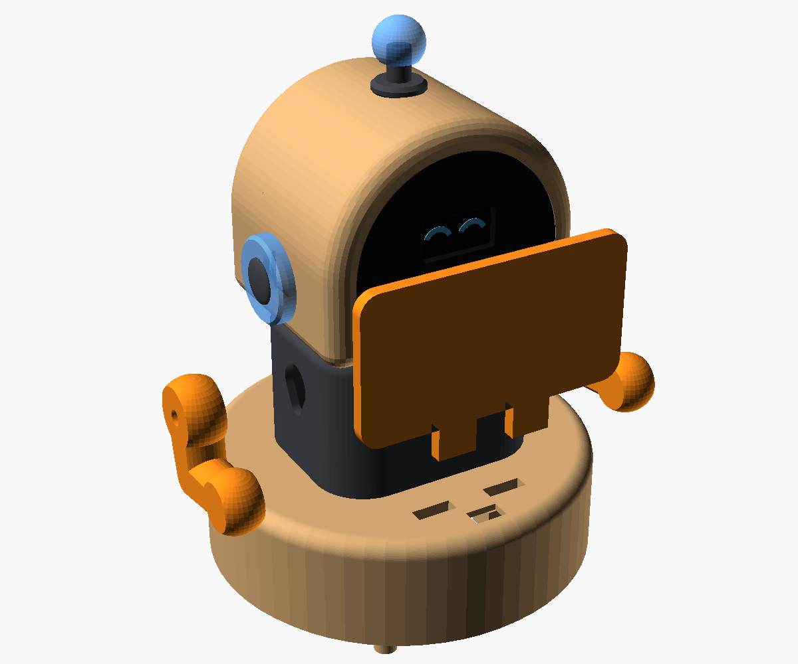

1. Press a single-arm horn into the pocket on the inner side of each arm, horn arm along the upper arm. Add a drop of glue.
2. The arm servos are still at 90° from Step 1. Push each arm onto its shaft with the arm pointing **straight forward**, level with the table.
3. Screw the horn screw in through the hole on the outside of the arm.
4. Stick the NTAG213 in the round pocket on the back of the sign.
5. Push the sign's two tabs into the slots at the front of the base.

The arms point forward at 90°, which is mid-way. In code, the hanging (rest) position is about 30° on one side and 150° on the other. Test with small steps so the hands don't hit the base.

## First power-on test

Test each part on its own before running the full program.

- [ ] Switch off, plug in the 5V adapter, switch on: the Nano's power LED lights
- [ ] I²C scanner sketch finds 0x3C (OLED) and 0x29 (VL53L0X)
- [ ] OLED shows a test image the right way up
- [ ] LED ring lights every LED in blue at low brightness, and the band glows
- [ ] Head turns smoothly from 50° to 130° without rubbing
- [ ] Each arm moves from the forward position toward rest without touching the base
- [ ] Sensor reads under 100 mm when a phone is held over the window
- [ ] Phone tap on the sign opens your Google review link (write the link to the NTAG213 with the free NXP TagWriter app)
